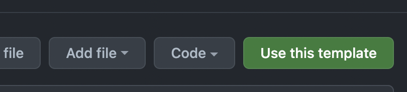

[](https://github.com/rootstrap/flutter-base/blob/master/LICENSE.md)

# Flutter Base Template

Flutter base is a boilerplate project created by Rootstrap for new projects using Flutter. The main
objective is helping any new projects jump start into feature development by providing a handful of
functionalities.

# Features

This template comes with:

- Dependency injection (GetIt).
- HttpClient already configured for Rootstrap BE Projects(Dio).
- Theming setup.
- Intl.
- State Management (Blocs/Cubit).
- Env config and flavors.

## How to use

1. Create a new repo using this template.

2. Clone your new repo.
3. Run `flutter doctor`.
4. Run `flutter pub get`.
5. Run your project
6. Done!

## Packages

- [GetIt](https://pub.dev/packages/get_it) For dependency injection.
- [Dio](https://pub.dev/packages/dio) A http client.
- [Blocs](https://pub.dev/packages/bloc) and [Cubit](https://pub.dev/packages/flutter_bloc) as State
  management library.

## Utilities

- [intl](https://pub.dev/packages/intl) and [intl_utils](https://pub.dev/packages/intl_utils) for
  localization.
- [flutter_svg](https://pub.dev/packages/flutter_svg) Svg Image loader.

## Code Quality Standards

In order to meet the required code quality standards, this project is following
this [tech guides considerations](https://github.com/rootstrap/tech-guides/blob/master/flutter/README.md).
It also runs [flutter analyze](https://dart.dev/tools/dart-analyze) for each build on your CI/CD tool.

## Security recommendations

### Third Party Keys

We strongly recommend that all private keys should be saved as ENV Vars on each platform. Our
Flavors config already manages this. In Android Studio, add the env var for each flavor:


Android: Go to `android -> app -> build.gradle` and add your env var name like this:

```
    def dartEnvironmentVariables = [
        YOUR_DEV_API_KEY: null
    ]
```

iOS: No extra configuration needed.

## CI/CD configuration with Bitrise (updated on Dec 12th 2021)

We are using Bitrise to configure and run
the [CI/CD pipelines](https://www.notion.so/rootstrap/Flutter-CI-CD-9a0a5957ee8442908fc00c3ea8f49bf1).

## License

Flutter-Base is available under the MIT license. See the LICENSE file for more info.

**NOTE:** Remove the free LICENSE file for private projects or replace it with the corresponding
license.

## Credits

**Flutter Base** is maintained by [Rootstrap](http://www.rootstrap.com) with the help of
our [contributors](https://github.com/rootstrap/flutter-base/contributors).

[](http://www.rootstrap.com)
