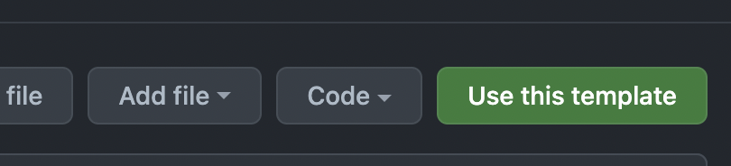
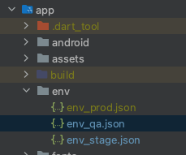
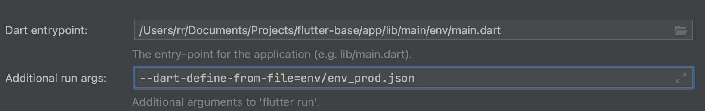
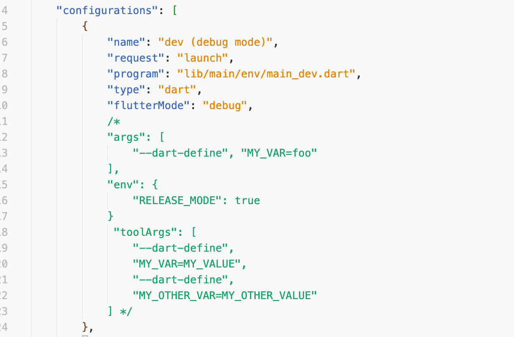

[](https://github.com/rootstrap/flutter-base/blob/master/LICENSE.md)

# Flutter Base Template

Flutter base is a boilerplate project created by Rootstrap for new projects using Flutter. The main
objective is helping any new projects jump start into feature development by providing a handful of
functionalities.

# Features

This template comes with:

- Melos: Manage actions.
- Dependency injection (GetIt).
- HttpClient already configured for Rootstrap BE Projects(Dio).
- Theming setup.
- Navigation Router and DeepLinks config with go_router
- Intl.
- State Management (Blocs/Cubit).
- Env config and flavors.
- Chat with Gemini and Vertex AI (Documentation and setup WIP)
- GitWorkflow config: RS-GPT-Review
- GitWorkflow config: Sonarqube

## Initial Setup

1. Create a new repo using this template.

   
2. Clone your new repo.
3. Install [FVM](https://fvm.app) (Flutter Version Management):
```text
    dart pub global activate fvm
```
4. Install the Flutter SDK version pinned in `.fvmrc`:
```text
    fvm install
```
   This downloads the exact Flutter version the repo is pinned to and links it at `.fvm/flutter_sdk`. All contributors and CI use the same version.
5. Run Flutter commands through FVM:
```text
    fvm flutter <command>
```
   Optionally add a shell alias (`alias flutter='fvm flutter'`) so you can keep typing `flutter ...`.
6. Install [Melos](https://melos.invertase.dev/getting-started) 7.x globally:
```text
    dart pub global activate melos
```
7. Verify melos is on the path: `melos --version`. If your shell does not find the command, add `pub-cache` to `PATH` (e.g. in `~/.zshrc` or `~/.bashrc`):
```text
    export PATH="$PATH":"$HOME/.pub-cache/bin"
```
8. Bootstrap the workspace (downloads packages for every workspace member):
```text
    melos bootstrap
```
9. Run `melos doctor` to verify the setup.

> Melos 7 uses [Dart pub workspaces](https://dart.dev/tools/pub/workspaces). The workspace is declared in the root `pubspec.yaml`, each package sets `resolution: workspace`, and there is a single shared `pubspec.lock` at the repo root.

### Upgrading the pinned Flutter version

When the team agrees to move to a new Flutter version, run `fvm use <version>` at the repo root and commit the updated `.fvmrc`. CI reads the pinned version from `.fvmrc`, so the change propagates automatically.

### IDE setup

- **VS Code**: settings are already wired in `.vscode/settings.json` — the Dart extension picks up `.fvm/flutter_sdk` automatically.
- **Android Studio / IntelliJ**: open `Preferences → Languages & Frameworks → Flutter` and set the SDK path to `<repo>/.fvm/flutter_sdk`.
10. Setup Android:
    - Add to the build.properties file (and update when needed):
```text 
    flutter.versionName=1.0.0
    flutter.appId=base
    flutter.versionCode=1
    flutter.compileSdkVersion=33
    flutter.minSdkVersion=21
    flutter.targetSdkVersion=33 
```

11. Android SignIn
    - Create your release Key Store:

```text
   keytool -genkey -v -keystore ~/keystore_name.jks -keyalg RSA -keysize 2048 -validity 10000 -alias your_alias"
```

- Create the 'key.properties' file with the keystore information:

```text
    storePassword=<YourStorePassword>
    keyPassword=<YourKeyPassword>
    keyAlias=<YourStoreAlias>>
    storeFile=<FilePath>
```

12. Add your env vars, create a config file for each env:
   
    - add the env config, i.e:

```text
    {
        "API_URL": "https://dummyjson.com"
    }
```

10. Setup iOs App Name and id:
   - Locate the config file for each flavor and configure the FLUTTER_APP_NAME i.e: Debug.xcconfig
```text
     FLUTTER_APP_ID=base.debug
     FLUTTER_APP_NAME=RS Base Debug
```

## Set up an editor

- Follow the [Android Studio](https://docs.flutter.dev/get-started/editor?tab=androidstudio)
  instructions to setup the editor

- Follow the [VS Code](https://docs.flutter.dev/get-started/editor?tab=vscode) instructions to setup
  the editor

## Running the App

1. Open a Simulator or Emulator
2. Open your project in your editor of preference

**Note:** Starting with **Flutter 2.8** in order for you to launch the app in **Android** you must
define the `flutter.compileSdkVersion` inside the `local.properties` file.

You can read more about
this [here](https://docs.page/bizz84/complete-flutter-course/faq/android-build-gradle-issues).

### Android Studio

1. Add a **Run Configuration**
    1. Add new **Flutter** configuration
    2. Give it a meaningful name **IE:** Dev, QA, Staging, Prod
    3. Pick the entry point, main.dart file location **IE:** ``.../lib/main/env/main_dev.dart``
2. Include any additional run arguments to launch the app.
    1. Create each env files config files in your root **app/**
       
    2. Setup your build, add the env file to the build command in AE:
       
3. Setup your env vars, i.e the api_url for each env:
    ```text
        {
            "API_URL": "https://dummyjson.com"
        }
    ```
4. Select the device to launch the App
5. Run the App

### VS Code

1. Go to **Run and Debug** section at the **Activity Bar**
2. At the top of the section expand the list and **Add Configuration**
3. Insert **Flutter Launch** configuration
    1. Update the environment name **(dev)**
    2. Update the launch program path **``/lib/main/env/main_dev.dart``**
    3. Update the **Flutter Mode** (debug, profile, release)
    4. Include any additional run argments to launch the app.
        1. Environment variables

           Add the env vars for each flavor with the property ``toolArgs``
           

4. Inside the **Run and Debug** section select the environment you want to excute
5. Make sure you have the device you want to use already open
6. Run the App

**Note 1:** Create as much **Launch Configurations** as you need for any specific environment.

**Note 2:** You shouldn't commit the **``.vscode/launch.json``** file.

## Build Production App:

1. Build your android appBundle or apk:
    - run the following command to build your appBundle

    ```text
        flutter build appBundle -t lib/main/env/main.dart --dart-define-from-file=env_prod.json
    ```

   [TODO: add how to setup Xcode for apple signIn]
2. Configure your iOs app sigIn.
    - run the following command to build your ipa

    ```text
        flutter build ipa --release -t lib/main/env/main.dart --dart-define-from-file=env_prod.json
    ```

For more information you can check the [docs](https://dartcode.org/docs/launch-configuration/)

## Packages

- [GetIt](https://pub.dev/packages/get_it) For dependency injection.
- [Dio](https://pub.dev/packages/dio) A http client.
- [Blocs](https://pub.dev/packages/bloc) and [Cubit](https://pub.dev/packages/flutter_bloc) as State
  management library.

## Utilities

- [intl](https://pub.dev/packages/intl) and [intl_utils](https://pub.dev/packages/intl_utils) for
  localization.
- [flutter_svg](https://pub.dev/packages/flutter_svg) Svg Image loader.
- Auto generate translations files with [intl_utils](https://pub.dev/packages/intl_utils).
 
-  ```text
         dart run intl_utils:generate
    ```
## Code Quality Standards

In order to meet the required code quality standards, this project is following
this [tech guides considerations](https://github.com/rootstrap/tech-guides/blob/master/flutter/README.md)
.
It also runs [flutter analyze](https://dart.dev/tools/dart-analyze) for each build on your CI/CD
tool.

## Security recommendations

### Obfuscation

TBD

## CI/CD configuration with Bitrise (updated on Dec 12th 2021)

We are using Bitrise to configure and run
the [CI/CD pipelines](https://www.notion.so/rootstrap/Flutter-CI-CD-9a0a5957ee8442908fc00c3ea8f49bf1)

### Github Actions: RS-GPT-Review
- Configure GPT secrets vars on your repo settings:
    - OPENAI_KEY
#### Note: The action will only run if the description or comments mentions @rs-gpt-review

### Github Actions: Sonarqube
- Go to you sonarqube server and configure a new project.
- Configure the sonar-project.properties:
    example:
    '''
        sonar.projectKey=your-app-key
        sonar.projectName=your-project-name
        sonar.host.url=https://your-sonarqube-server.net
        sonar.projectVersion=1.0
        sonar.sourceEncoding=UTF-8
    '''
# Main source directories
sonar.sources=app/lib,modules/domain,modules/data,modules/common
sonar.dart.exclusions=pubspec.yaml
sonar.dart.analyzer.report.mode=LEGACY
- Configure Sonarqube secrets vars on your repo settings:
  - SONAR_TOKEN (your sonarqube project token)
  - SONAR_URL (your sonarqube server url)

## License

Flutter-Base is available under the MIT license. See the LICENSE file for more info.

**NOTE:** Remove the free LICENSE file for private projects or replace it with the corresponding
license.

## Credits

**Flutter Base** is maintained by [Rootstrap](http://www.rootstrap.com) with the help of
our [contributors](https://github.com/rootstrap/flutter-base/contributors).

[](http://www.rootstrap.com)
