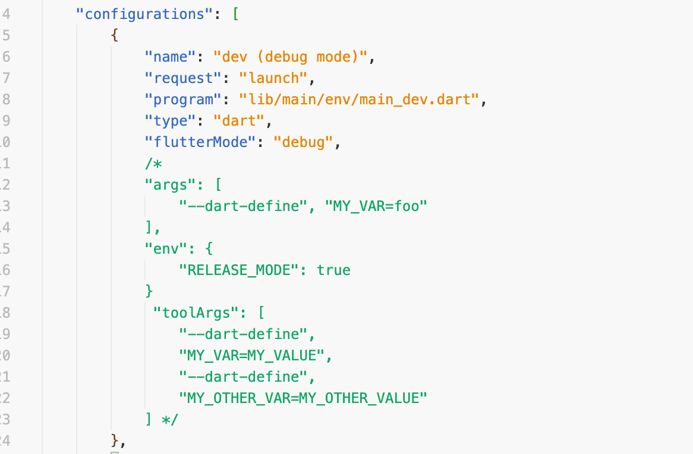

[](https://github.com/rootstrap/flutter-base/blob/master/LICENSE.md)

# Flutter Base Template

Flutter base is a boilerplate project created by Rootstrap for new projects using Flutter. The main
objective is helping any new projects jump start into feature development by providing a handful of
functionalities.

# Features

This template comes with:

- Dependency injection (GetIt).
- HttpClient already configured for Rootstrap BE Projects(Dio).
- Theming setup.
- Navigation Router and DeepLinks config with go_router
- Intl.
- State Management (Blocs/Cubit).
- Env config and flavors.

## Initial Setup

1. Create a new repo using this template.

   
2. Clone your new repo.
3. Run `flutter doctor`.
4. Run `flutter pub get`.
5. Setup Android: 
   - Add to the local.properties file (and update when needed):
```text 
     flutter.versionName=1.0.0
     flutter.versionCode=1
     flutter.compileSdkVersion=33
     flutter.minSdkVersion=21
     flutter.targetSdkVersion=33 
```
6. Android SignIn
   - Create your release Key Store:
```text
   keytool -genkey -v -keystore ~/keystore_name.jks -keyalg RSA -keysize 2048 -validity 10000 -alias your_alias"
```
   - Create the 'key.properties' file with the keystore information:
```text
    storePassword=<YourStorePassword>
    keyPassword=<YourKeyPassword>
    keyAlias=<YourStoreAlias>>
    storeFile=<FilePath>
```

## Set up an editor

- Follow the [Android Studio](https://docs.flutter.dev/get-started/editor?tab=androidstudio) instructions to setup the editor

- Follow the [VS Code](https://docs.flutter.dev/get-started/editor?tab=vscode) instructions to setup the editor

## Running the App

1. Open a Simulator or Emulator
2. Open your project in your editor of preference

**Note:** Starting with **Flutter 2.8** in order for you to launch the app in **Android** you must define the `flutter.compileSdkVersion` inside the `local.properties` file.

You can read more about this [here](https://docs.page/bizz84/complete-flutter-course/faq/android-build-gradle-issues).

### Android Studio

1. Add a **Run Configuration**
    1. Add new **Flutter** configuration
    2. Give it a meaningful name **IE:** Dev, QA, Staging, Prod
    3. Pick the entry point, main.dart file location **IE:** ``.../lib/main/env/main_dev.dart``
2. Include any additional run arguments to launch the app.
    1. Environment variables

        Add the env var for each flavor: 

3. Select the device to launch the App
4. Run the App

### VS Code

1. Go to **Run and Debug** section at the **Activity Bar**
2. At the top of the section expand the list and **Add Configuration**
3. Insert **Flutter Launch** configuration
    1. Update the environment name **(dev)**
    2. Update the launch program path **``/lib/main/env/main_dev.dart``**
    3. Update the **Flutter Mode** (debug, profile, release)
    4. Include any additional run argments to launch the app.
        1. Environment variables

            Add the env vars for each flavor with the property ``toolArgs``
            

4. Inside the **Run and Debug** section select the environment you want to excute
5. Make sure you have the device you want to use already open
6. Run the App

**Note 1:** Create as much **Launch Configurations** as you need for any specific environment.

**Note 2:** You shouldn't commit the **``.vscode/launch.json``** file.

For more information you can check the [docs](https://dartcode.org/docs/launch-configuration/)

## Packages

- [GetIt](https://pub.dev/packages/get_it) For dependency injection.
- [Dio](https://pub.dev/packages/dio) A http client.
- [Blocs](https://pub.dev/packages/bloc) and [Cubit](https://pub.dev/packages/flutter_bloc) as State
  management library.

## Utilities

- [intl](https://pub.dev/packages/intl) and [intl_utils](https://pub.dev/packages/intl_utils) for
  localization.
- [flutter_svg](https://pub.dev/packages/flutter_svg) Svg Image loader.
- [dart_code_metrics] (<https://dartcodemetrics.dev/docs/rules>) Dart code static analysis code.

## Code Quality Standards

In order to meet the required code quality standards, this project is following
this [tech guides considerations](https://github.com/rootstrap/tech-guides/blob/master/flutter/README.md).
It also runs [flutter analyze](https://dart.dev/tools/dart-analyze) for each build on your CI/CD tool.

## Security recommendations

### Obfuscation

TBD

## CI/CD configuration with Bitrise (updated on Dec 12th 2021)

We are using Bitrise to configure and run
the [CI/CD pipelines](https://www.notion.so/rootstrap/Flutter-CI-CD-9a0a5957ee8442908fc00c3ea8f49bf1).

## License

Flutter-Base is available under the MIT license. See the LICENSE file for more info.

**NOTE:** Remove the free LICENSE file for private projects or replace it with the corresponding
license.

## Credits

**Flutter Base** is maintained by [Rootstrap](http://www.rootstrap.com) with the help of
our [contributors](https://github.com/rootstrap/flutter-base/contributors).

[](http://www.rootstrap.com)
