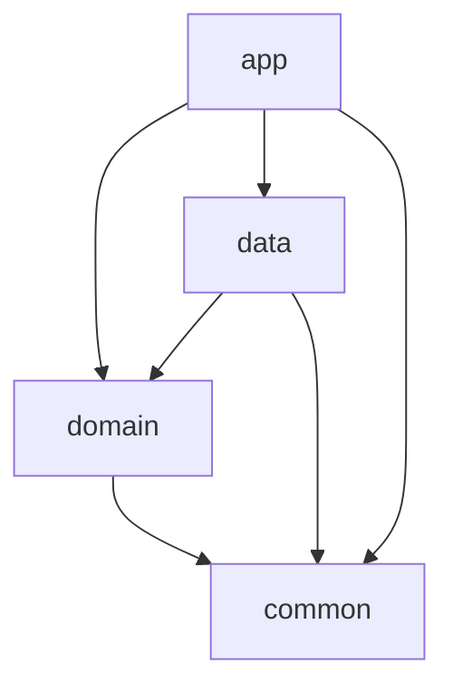

# Module guide

A **module** is a local Dart/Flutter package under `modules/<name>/` with its own `pubspec.yaml`,
`analysis_options.yaml`, and `lib/`. It is consumed through a `path:` dependency. The repo is a **Dart pub
workspace**: the root `pubspec.yaml` lists every member under `workspace:`, each member sets
`resolution: workspace`, and one shared `pubspec.lock` sits at the root. Melos 7 reads the same workspace, with
its scripts under the root pubspec's `melos:` key. `melos bootstrap` resolves everything.

## Packages

| Package | pubspec `name` | Depends on (workspace) | Responsibility | Must NOT contain |
|---|---|---|---|---|
| `app/` | `app` | domain, data, common | UI, routing, theme, l10n, flavors, composition root (DI) | business rules, HTTP/storage calls |
| `modules/domain/` | `domain` | common | cubits and states, services, repository interfaces, models, env constants | Dio, shared_preferences, widgets, imports of `data` or `app` |
| `modules/data/` | `data` | domain, common | repository implementations, Dio setup and interceptors, `Preferences`, data sources | widgets, cubits, imports of `app` |
| `modules/common/` | `common` | none | result/failure types, platform and permission abstractions, analytics interface, validators, generic widgets (`ResponsiveBuilder`) | feature/product knowledge, imports of any workspace package |

## Dependency rules

**Allowed:** only the arrows above. These rules are **protected boundaries**. Changing them needs an
explicit architecture decision, not a drive-by edit.

**Forbidden:**
- `common` → anything in the workspace.
- `domain` → `data` or `app` (domain owns the interfaces, and data implements them).
- `data` → `app`.
- `app` → `package:data/...` anywhere except `app/lib/main/init.dart` (it calls `DataInit.initialize`).
  Presentation reaches data through domain interfaces resolved from GetIt.
- A cycle of any kind. Path deps would allow it at the pub level, so check it by review.

**Current exceptions (debt, don't replicate):**
- `app/lib/presentation/ui/custom/cookies.dart` reads `CommonRepository` directly instead of going through a cubit or service.
- `domain` depends on `flutter_dotenv` (in `EnvConfig`), which is an infrastructure concern.
- `common` depends on `dio` (for `FailureMapper`) and `flutter_bloc` (for `CancelableCubitMixin`).

None of this is enforced by tooling. The analyzer won't flag a forbidden import, because every
package can technically import any path dependency it declares. **Enforcement is the pubspec
dependency list plus review.** Adding a workspace path dependency to a pubspec is therefore an
architectural change.

## Public API of a module

There are no barrel files and no `src/` privacy. Consumers import files directly
(`package:domain/bloc/auth/auth_cubit.dart`). Conventions that approximate a public surface:

- **`init.dart` + `XInit.initialize(GetIt)`** is the module's DI entrypoint. It's the only thing `app` needs
  from `data`.
- A **leading underscore in a file name** (`_permission_manager_base.dart`, `_app_platform_impl.dart`)
  marks an implementation file that should be reached through its `abstract/` interface and GetIt, not imported directly.
- **`abstract/` vs. `concrete/`** folders in `common` separate the interface from the platform implementation.
- Interfaces meant for other layers live in `domain/repositories/` and `domain/services/`.

## How modules communicate

- **At startup**, through GetIt: each module registers its implementations against interfaces.
  Registration order is Common → Data → Domain.
- **At runtime**: widget → cubit (domain) → service (domain) → repository interface (domain) → implementation (data).
- **Data flows back** as `ResultType<T>`, and cubits expose it as `Resource<T>` state.
- **Between features**: through a shared service or by observing a global cubit. Cubits don't call each other.

## Naming conventions (observed)

- Files: `snake_case.dart`. Cubit `x_cubit.dart` + state `x_state.dart` in `domain/lib/bloc/<feature>/`.
- Services: `domain/lib/services/<name>_service.dart`, class `<Name>Service`.
- Repositories: interface `domain/lib/repositories/<name>_repository.dart` (`<Name>Repository`), and implementation
  `data/lib/repositories/<name>_repository_impl.dart` (`<Name>RepositoryImpl`).
- Pages: `app/lib/presentation/ui/pages/<area>/<feature>/<feature>_page.dart`, with sub-widgets beside them
  (`login_form.dart`, `home_view.dart`).
- Enums for models provide `toName()` / `fromName()` (`AppLang`, `ThemeType`, `AuthStatus`).
- States: sealed class hierarchies (`AuthState`) or immutable classes with `copyWith` (`AppState`).

## Creating a new module

Use this when a capability is large, reusable, or independently versionable (for example, a payments SDK
wrapper or a chat feature). Most features should **not** become modules. They go into the existing layers.

1. `cd modules && flutter create --template=package <name>`. The existing modules were generated this way and
   still carry the template README and CHANGELOG. Replace those.
2. In `modules/<name>/pubspec.yaml`: set `publish_to: none` and `resolution: workspace`, match the environment
   constraints of the other members (`sdk: ">=3.6.0 <4.0.0"`, `flutter: ">=3.41.0"`), and add only the workspace
   dependencies its layer allows (usually `common`, and `domain` if it implements domain interfaces).
3. Add `modules/<name>` to the `workspace:` list in the root `pubspec.yaml`. Without it, `resolution: workspace` fails.
4. Copy `analysis_options.yaml` from a sibling module (`include: package:flutter_lints/flutter.yaml`) and add
   `flutter_lints: ^5.0.0` to its dev dependencies.
5. Add `lib/init.dart` with `class <Name>Init { static Future<void> initialize(GetIt getIt) async { … } }`.
6. Wire it: add a `path: ../modules/<name>` dependency in `app/pubspec.yaml` and call `<Name>Init.initialize(getIt)`
   in `app/lib/main/init.dart` at the right point in the order.
7. Add `modules/<name>/lib` to `sonar.sources` in `sonar-project.properties`. Otherwise `coverage/full_coverage.py`
   warns and Sonar ignores it. Add `modules/<name>/test` to `sonar.tests` once tests exist.
8. `melos bootstrap`, then `melos run analyze` and `melos run format`.
9. Update the Packages table above and the dependency diagram.

`addModule.py` is meant to import prebuilt modules from `rootstrap/flutter-modules` (`module/<name>` branches),
but its copy path is wrong (known-issues #6). Do the copy by hand, following steps 2–9. Modules from that source
may predate the pub workspace, so add `resolution: workspace` and align their constraints.
