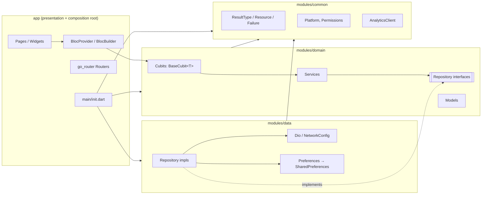
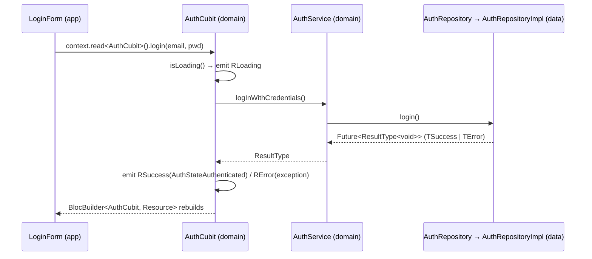

# Architecture overview

This describes the architecture **as implemented**. Deviations and defects are recorded in
[known-issues.md](known-issues.md). Module boundaries and dependency rules are in [modules.md](modules.md).

## Style

This is a layered architecture with dependency inversion, split across Dart packages:

- **Presentation** (`app`): widgets, routing, theme, l10n, composition root.
- **Domain** (`modules/domain`): cubits and states, services, repository interfaces, models.
- **Data** (`modules/data`): repository implementations, networking, local storage.
- **Common** (`modules/common`): feature-agnostic primitives shared by all layers.

It is *not* textbook Clean Architecture. There are no use-case classes (**services** play that role),
and **state management lives in `domain`**: cubits are domain classes, and `flutter_bloc` is a domain
dependency. Folders are organized by layer, not by feature. A feature is spread across the packages
by layer (see [feature-guide.md](../development/feature-guide.md)).

## Request/response data flow

The canonical path, taken from the auth example:

Key types (all in `modules/common/lib/core/`):

| Type | Where used | Shape |
|---|---|---|
| `ResultType<T>` (sealed) | repository/service return values | `TSuccess<T>(data)` or `TError<T>(Exception?)` |
| `Resource<T>` | cubit state (via `BaseCubit<T>`) | `RLoading` / `RSuccess` / `RError`, and each keeps the last `data` |
| `Failure` (sealed, `implements Exception`) | the error payload in `TError` / `RError` | `ConnectionFailure`, `SocketTimeOutFailure`, `HttpFailure(code)`, `UnexpectedFailure` |
| `DioException.toFailure()` | inside data-layer repositories | maps Dio error types to `Failure` |

`BaseCubit<T>` (`domain/lib/bloc/base_cubit.dart`) provides `isLoading()`, `isSuccess(T)`, `isError(e)`,
and `onResult(ResultType<T>)`. `ListBlocState<T>` extends it for list screens. `CancelableCubitMixin`
(common) cancels in-flight futures on `close()`.

> Prefer `onResult` or a `switch` on the sealed `ResultType`. `mapSuccess`/`mapError` also work for side effects
> (as in `AuthCubit`). `mapError` keeps the original error unless its callback returns an `Exception`.

## State ownership

- **Global cubits** are registered as GetIt singletons in `DomainInit` and provided once in `App`
  (`MultiBlocProvider`):
  - `AppCubit`: theme and language (`AppState`, persisted through `CommonRepository`).
  - `AuthCubit`: auth status (`BaseCubit<AuthState>`; sealed `AuthState`: Unknown/Authenticated/Unauthenticated/Error).
- **Screen cubits** (none exist yet; the intended pattern per `home_page.dart`'s TODO) should be created by a
  `BlocProvider(create: (_) => XCubit(getIt()))` in the page widget, so they are disposed with the route.
- Cubits don't call each other. Coordination goes through services or widgets.

## Dependency injection

GetIt, with one instance: `getIt = GetIt.instance` in `app/lib/main/init.dart`. Startup
(`init()` → `initialize()`):

1. `dotenv.load(fileName: Environment.envConfigFile)`
2. `CommonInit.initialize(getIt)`: `AppPlatform` (a conditional import selects the io or web impl), `PlatformInfo`, `PermissionManager`
3. `DataInit.initialize(getIt)`: `SharedPreferences`, `Preferences`, `AuthTokenInterceptor`, `Dio`, `EnvironmentService`, `AuthRepository`, `CommonRepository`
4. `DomainInit.initialize(getIt)`: `AuthService`, then the `AppCubit` and `AuthCubit` singletons
5. `runApp(App())`

The order matters: Domain registers eager singletons that resolve the repositories from Data.
`common/lib/init.dart` also keeps its own top-level `late GetIt getIt` (set in `CommonInit`), which
common widgets like `ResponsiveBuilder` use.

Conventions: register an interface type (`registerLazySingleton<AuthRepository>(() => AuthRepositoryImpl(getIt()))`).
Widgets resolve with `getIt<T>()` only for global objects. Prefer `context.read<T>()` for cubits in the tree.

## Navigation

`app/lib/presentation/navigation/routers.dart`:

- The `Routes` enum is the single list of route names. `path` = `/<name>`, `subPath` = `<name>` (for nested
  routes), and `Routes.x.go(context)` navigates by name.
- The tree: `/` (it renders `SplashPage` wrapped in a `BlocListener<AuthCubit>` that redirects on auth
  changes) → two `ShellRoute`s (each wraps children in `DebugBanner` when `kDebugMode`):
  - **Unauthenticated:** `/onboarding`, `/auth` (login) → `/auth/signup`.
  - **Authenticated:** `/app` (home) → `/app/placeholder`.
- **Guards:** a per-route `redirect` checks `getIt<AuthCubit>().isLoggedIn()`.
- **Deep links:** `App._initRouter` reads the initial location from `Uri.base` (web) or
  `AppLinks().getInitialLink()` (mobile) before building the router. The web router uses path URLs
  (`usePathUrlStrategy()`).

To add a screen: add an enum value, add a `GoRoute` under the correct shell, then navigate with `Routes.x.go(context)`.

## Networking

`modules/data/lib/network/`:

- `NetworkConfig.provideDio(AuthTokenInterceptor?)` sets `baseUrl: EnvConfig.apiUrl` and timeouts from
  `NetworkConstants` (2 s connect / 2 s receive). In debug it adds a `LogInterceptor`.
- `AuthTokenInterceptor` adds `token: <value>` + `Content-Type: application/json` when a token is
  stored, and **clears all preferences** on 401/403/422 or when no token is present.
- `EnvironmentServiceImpl.setEnvironment(env)` switches `EnvConfig.env` at runtime and updates the Dio base
  URL. The `EnvironmentSelector` widget uses it.
- `data_sources/remote` and `data_sources/local` hold only READMEs. **No repository calls Dio yet.**
  `AuthRepositoryImpl` is a fake that sleeps for 1 s and stores `'new-token'`.

## Persistence

`Preferences` (abstract) and `PreferencesImpl` (shared_preferences) in `modules/data/lib/preferences/` store
the token, language, theme, and cookie consent. Only data-layer code touches `Preferences`. Domain and app
go through `CommonRepository` / `AuthRepository`. There is no database, secure storage, or cache layer.

## Environments and flavors

There are two mechanisms, and they don't fully agree. Understand both before changing either.

| Piece | File | What it does |
|---|---|---|
| Entrypoints | `app/lib/main.dart` (prod), `app/lib/main/env/main_dev.dart`, `main_qa.dart` | Construct `FlavorConfig(flavor: …)`, which sets `EnvConfig.env` to `DEV`/`QA`/`PROD` |
| dotenv file choice | `Environment.envConfigFile` in `app/lib/main/env/env_config.dart` | Loads `env/.<ENV>`, where `ENV` is the `--dart-define` `ENV` value (default `dev`) |
| API URL lookup | `EnvConfig.apiUrl` in `modules/domain/lib/env/env_config.dart` | Reads `API_URL_<DEV|QA|PROD>`, falling back to `API_URL` |
| Bundled files | `app/pubspec.yaml` assets: `env/` | Everything in `app/env/` ships inside the app bundle |

The committed `env/.dev` defines `API_URL` (no suffix) and `ENV=dev`, which the fallback picks up. `env/.env.example`
shows the alternative single-file, suffixed format. See known-issues #2 for the full list of drift (unused `getEnvFilePath`, the `.env`
naming in comments vs. `.dev` on disk, and the fact that bundled env files are readable by anyone with the binary).

Platform flavor support:
- **iOS:** build configurations `Debug/Release/Profile` × (`dev`, `qa`, and default), and schemes `Dev`, `QA`,
  `Runner`. `ios/Flutter/AppIdentity.xcconfig` holds `APP_BUNDLE_ID` and `APP_DISPLAY_NAME`. `ios/Flutter/Debug.xcconfig`,
  `Release.xcconfig`, `ios/dev.xcconfig` and `ios/qa.xcconfig` include it and set `FLUTTER_TARGET` and `FLUTTER_APP_NAME`.
  Bundle ID = `$(APP_BUNDLE_ID)` plus `.debug`, `.dev` or `.qa` suffixes; the full table is in
  [project-initialization.md](../development/project-initialization.md#what-init-changes). Plugins are integrated
  with Swift Package Manager (no CocoaPods), and the app uses the UIScene lifecycle (`FlutterSceneDelegate`).
- **Android:** no product flavors. `android/build.properties` holds `flutter.applicationId`, `flutter.namespace` and
  `flutter.appName` (the launcher label, via the `appLabel` manifest placeholder) plus the SDK levels. The debug build type
  adds `.debug`. Environment selection is by `-t` entrypoint only.

## Error handling

- The data layer should catch `DioException` and return `TError(e.toFailure())`. Nothing does yet, because
  there are no real remote calls.
- Cubits turn errors into `RError(exception)`. Widgets branch on `state is RError`.
- `FailureWidget(failure:, onRetry:)` (app `ui/custom/`) renders connection and unexpected errors with retry.
- There is no global error handler, crash reporter, or structured logger. `debugPrint` and `dart:developer` `log` are used.

## Localization

`intl` + `intl_utils` (the `flutter_intl` block in `app/pubspec.yaml`). ARB sources are
`app/lib/presentation/resources/locale/intl_en.arb` / `intl_es.arb`, generated into `locale/generated/` as class `S`.
Use `S.of(context).key`. The supported locales and the `AppLang` ↔ `Locale` map are in
`app/lib/presentation/utils/lang_extensions.dart`. The domain enum `AppLang` must stay in sync with that map.

## Theming

Material 3 with tonal palettes: `ThemeColors` (abstract) is implemented by `LightThemeColors` and
`DarkThemeColors`. Each is a `MaterialColor` with tones 0–100, and `AppThemeData.colorScheme` maps
tones to Material roles. `LocalTheme` builds `ThemeData` and the text styles (Roboto families bundled in
`app/fonts/`). Access them with `Theme.of(context)`, `context.colors.primary.v40`, or `context.localTheme`
(extension in `app_themes.dart`). The theme type is persisted by `AppCubit`.

## Analytics and platform

- `AnalyticsClient` (common) is the interface. `FirebaseAnalytics` is a stub that throws `UnimplementedError`.
  `TrackedPage` (app `ui/base/`) auto-tracks lifecycle events, **but no `AnalyticsClient` is registered and the
  `routeObserver` isn't attached to GoRouter** (known-issues #4). Treat analytics as an unwired extension point.
- `firebase_core` is a dependency, and `Firebase.initializeApp` is commented out in all three entrypoints.
- `AppPlatform` / `PlatformInfo` / `PermissionManager` (common/devices) abstract platform checks and
  camera/gallery/notification permissions. Web and io implementations are chosen by conditional imports in
  `common/lib/init.dart`.
